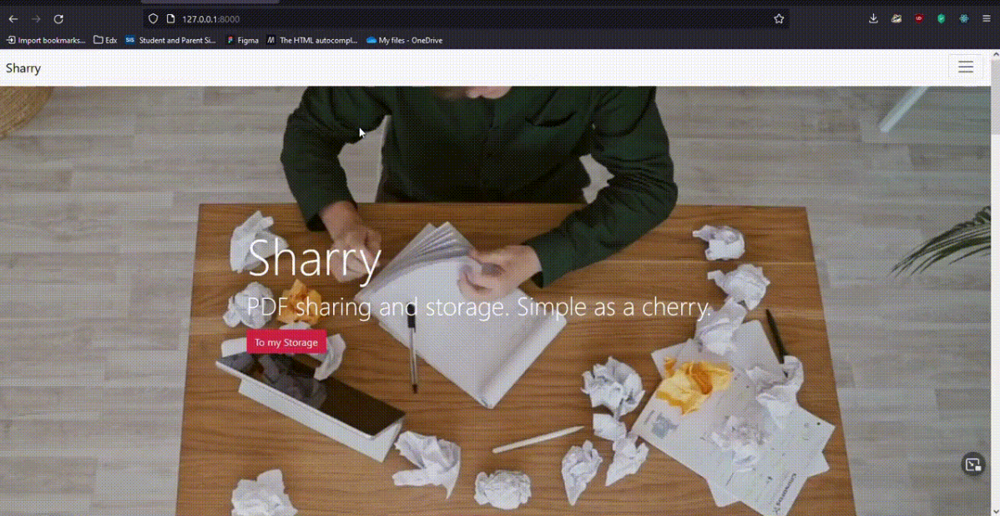

# Sherry PDF File Sharing

## About

This site is a full stack website using Django in the backend and React for the frontend. It stores and handles PDF files, allowing for upload and download.

### File

/frontend is the react app
/fileshare is the Django app

## Features

1. Login/out
2. Create Account
3. Upload PDF
4. Share PDF
5. Make PDF Public
6. Add tags to PDF
7. Search for PDF by tags and name
8. Remove users from share list
9. Hide from public
10. Delete file

## What I learned

### Frontend

1. React DOM
2. Framer Motion
3. React Bootstrap
4. Bootstrap5

### Backend

1. Django Rest Framework
2. DJ-All-Auth
3. Authenticating users
4. Class Based views
5. Handling files
6. Sending emails via python
